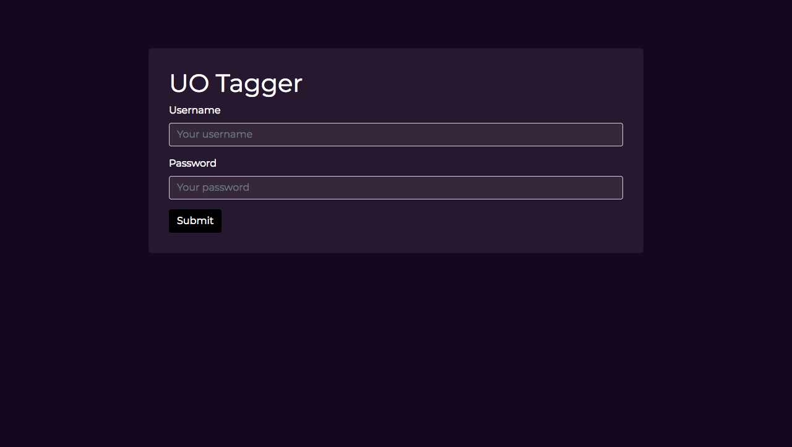
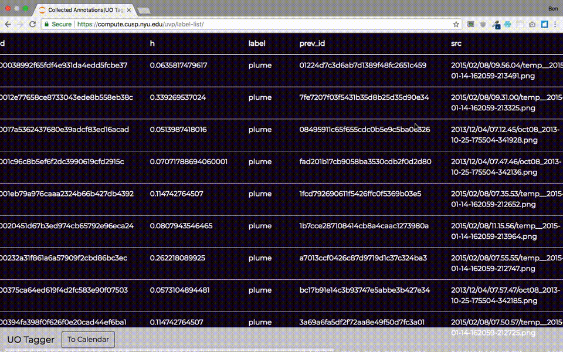
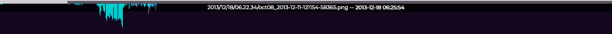
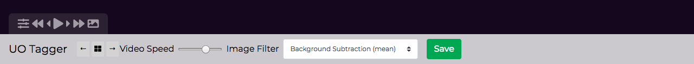

# Using the UO Tagging App

## Startup

To start the app, just run:

```
uo-tagger

# you can also specify a custom config file
uo-tagger --cfg custom-config.yaml
```

Then just go to `http://localhost:5000/` or `http://localhost:5000/cal/` to get started.

## Login

The first page you should see is a login page: `http://localhost:5000/login`

By default the username and password are admin:admin, but this can be changed via the config file.



## Calendar

The calendar can be accessed via `http://localhost:5000/` or `http://localhost:5000/cal/`. This contains a summary of the number of images and labels per day. Click a date to access the images for that day.


Click on the `Collected Labels` button for a quick view of all collected labels.



## Video

### Navigating the Images

The images are loaded sequentially. At the top of the window is a video timeline that shows the current image index that is currently being displayed. Directly below the timeline is a stack of boxes indicating the number of labels gathered at that frame in the image. They only update when the boxes are saved and the page is refreshed. Just below that is the title bar which shows the filename and timestamp of the current image.

To jump to a point in the day, click on the corresponding point in the timeline. 



At the bottom of the window are some video controls. The double arrows are jump backwards and jump forwards respectively. The default step is 10 frames, but this is configurable. The single arrows are step back and step forwards 1 frame, respectively. The play/pause button plays and pauses the video. Not that any of that needed to be spelled out. The image icon toggles the current filter to and from the Original image for easy switching between the two. The icon on the left expands the controls menu.

The controls menu has a slider for changing the video playback speed. Moving left to right speeds up the video. The image filter dropdown contains a variety of filters that can be applied to the image, defined in the image processor class. 



### Drawing Labels

To draw a label, click anywhere on the image. That will draw an empty box. To expand the box, Shift-click and drag until it is the right size. To adjust the position, just drag the box around the image. To change the label, change the value of the dropdown directly above the box. To keep a box selected, click on it and you will see that even when you move the cursor out of the box, the center handle remains visible. This indicates that a box is selected. To select multiple boxes, just hold down shift when clicking. To delete a box, simply drag it outside of the bounds of the image.


### Keyboard Shortcuts

- `SPACE`: play/pause video
- `LEFT ARROW`: step back 1 image
- `RIGHT ARROW`: step forward 1 image
- `cmd-A, ctl-A`: select all boxes
- `cmd-Del, ctl-Del`: delete all selected boxes
- `UP ARROW`: toggle between `Original` filter and the previously selected filter
- `ENTER`: carry over ghostboxes. turn into 'real' boxes
- 'cmd-S, ctl-S': save all modified/created boxes
- `1-9`: with boxes selected, click any digit to change the label to the label with that index. see label dropdown for the ordering.


